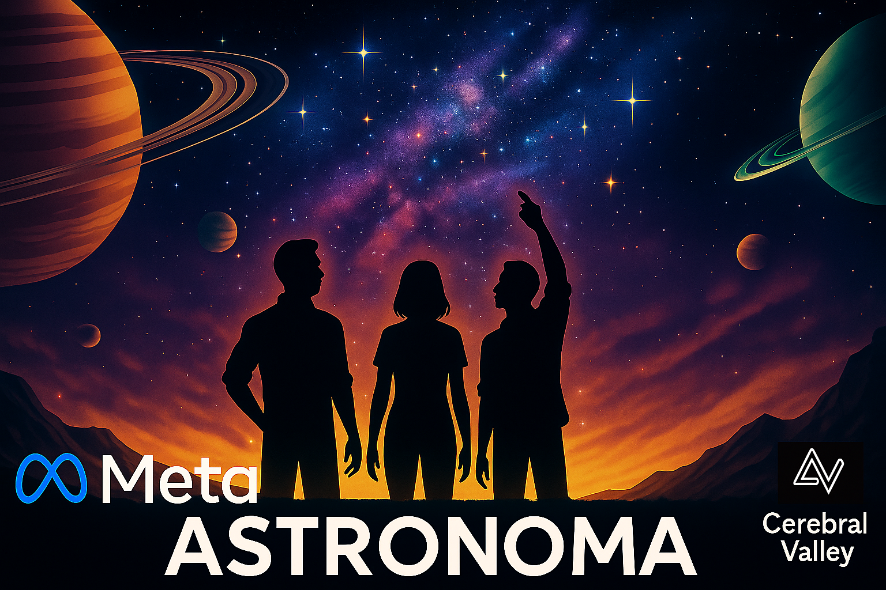
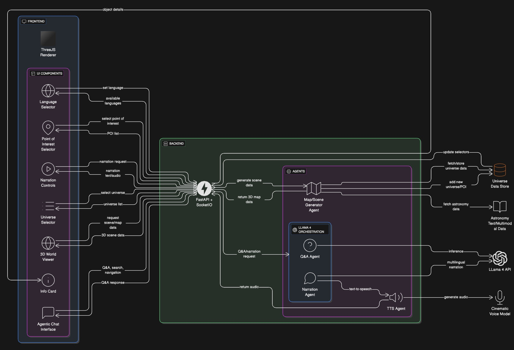
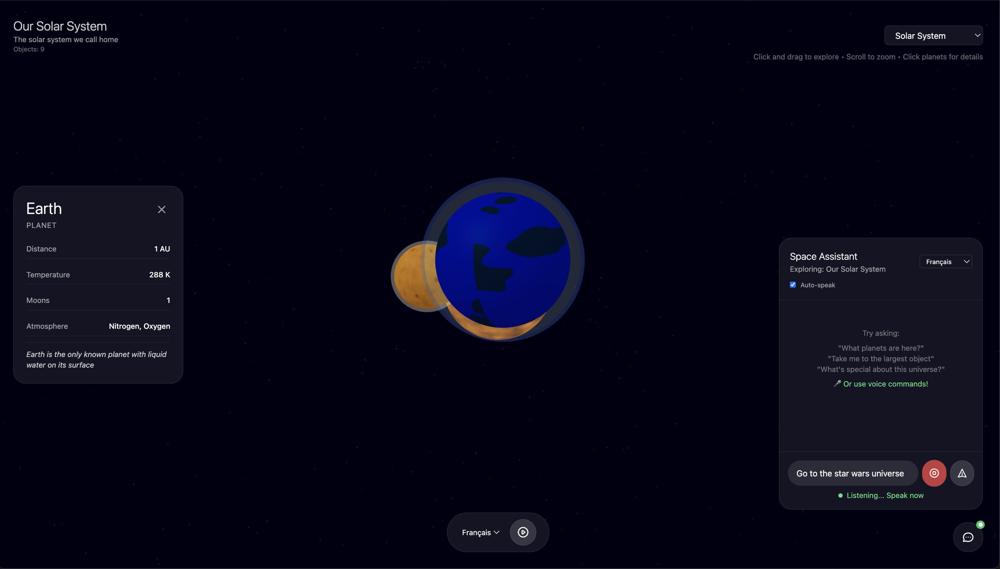
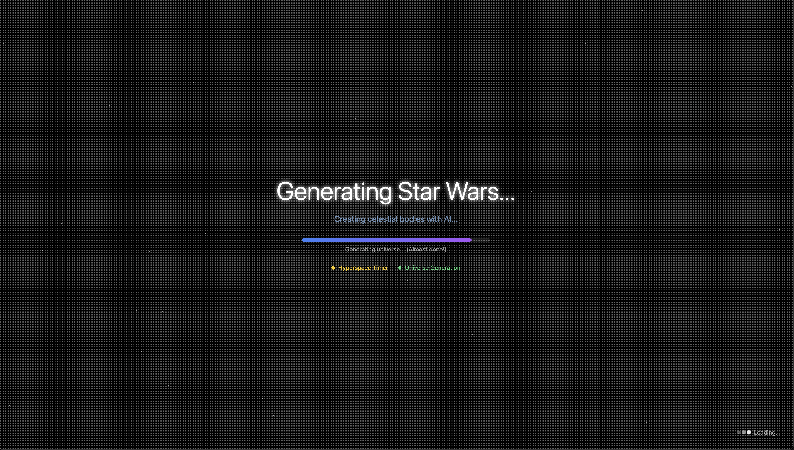
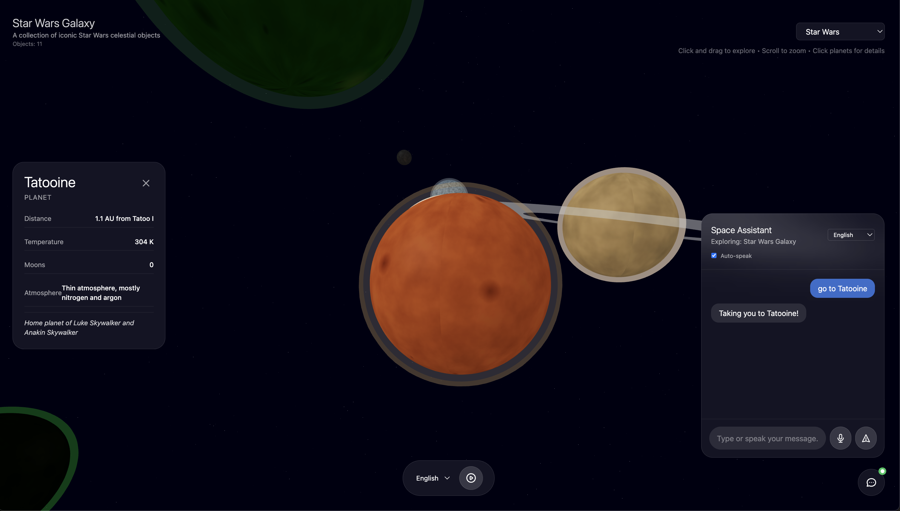
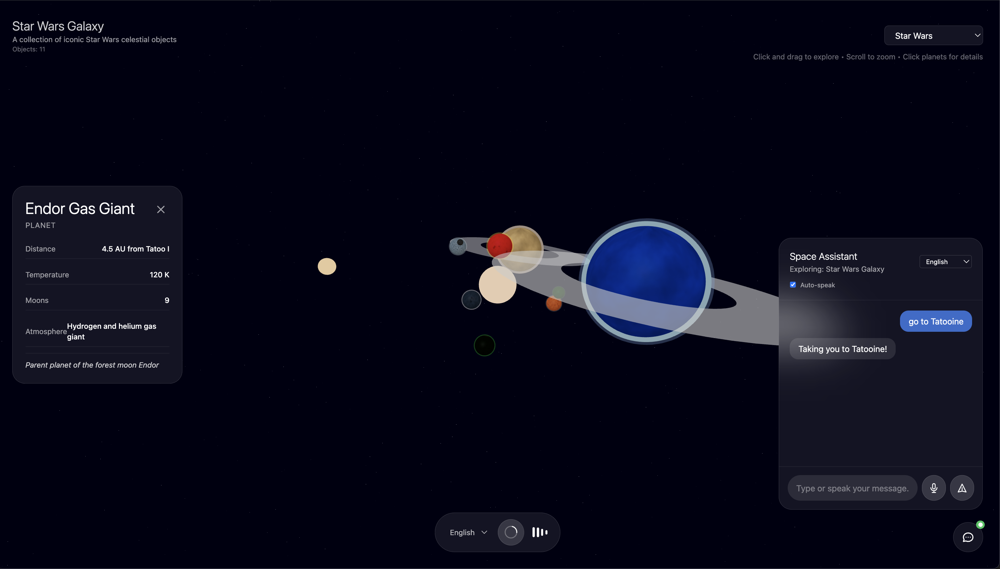

# Astronoma - AI-Powered Universe Explorer


Explore the cosmos with Llama 4-powered narration and intelligent Chat assistance.
## Quick Start

### Prerequisites
- Node.js 18+
- Python 3.9+
- Llama 4 API key

### Installation

1. Clone the repository:
```bash
git clone [your-repo-url]
cd astronoma
```

2. Set up the backend:
```bash
cd backend
python -m venv venv
source venv/bin/activate  # Windows: venv\Scripts\activate
pip install -r requirements.txt
cp .env.example .env
# Add your LLAMA_API_KEY to .env
```

3. Set up the frontend:
```bash
cd ../frontend
npm install
cp .env.example .env
```

### Running the Application

1. Start the backend (from `/backend`):
```bash
uvicorn app.main:socket_app --host localhost --port 3000 --reload
```

2. Start the frontend (from `/frontend` in a new terminal):
```bash
npm run dev
```

3. Open http://localhost:5173 in your browser

## Features

- 🌌 3D visualization of the solar system
- 🎙️ AI-generated narration in multiple languages
- 💬 Intelligent chat assistant for navigation
- 🔍 Search functionality for celestial objects
- 🌐 Multilingual support (English, Spanish, French, Hindi)

## Controls

- **Click and drag**: Rotate view
- **Scroll**: Zoom in/out
- **Click planet**: View information
- **Chat**: "Take me to Mars", "What's the largest planet?"

## Tech Stack

- Frontend: React, Three.js, TypeScript, Tailwind CSS
- Backend: FastAPI, Python, Socket.io
- AI: Llama 4 API

## Astronoma Architecture


## Screenshots

### Speak actions and move through the world


### Generate and explore fictional universes 


### Navigate through and between universes using our Space Assistant (Voice Mode also available)


### Custom Narration Generated from the current view to make every scene interesting



## Project Structure

```
astronoma/
├── frontend/          # React frontend
├── backend/           # Python backend
└── README.md         # This file
```

## Troubleshooting

### Backend won't start
- Ensure Python 3.9+ is installed
- Check that all dependencies are installed
- Verify LLAMA_API_KEY is set in .env

### Frontend connection issues
- Ensure backend is running on port 3000
- Check VITE_API_URL in frontend .env

### No narration audio
- Check browser audio permissions
- Ensure browser supports Web Speech API

## License

MIT
